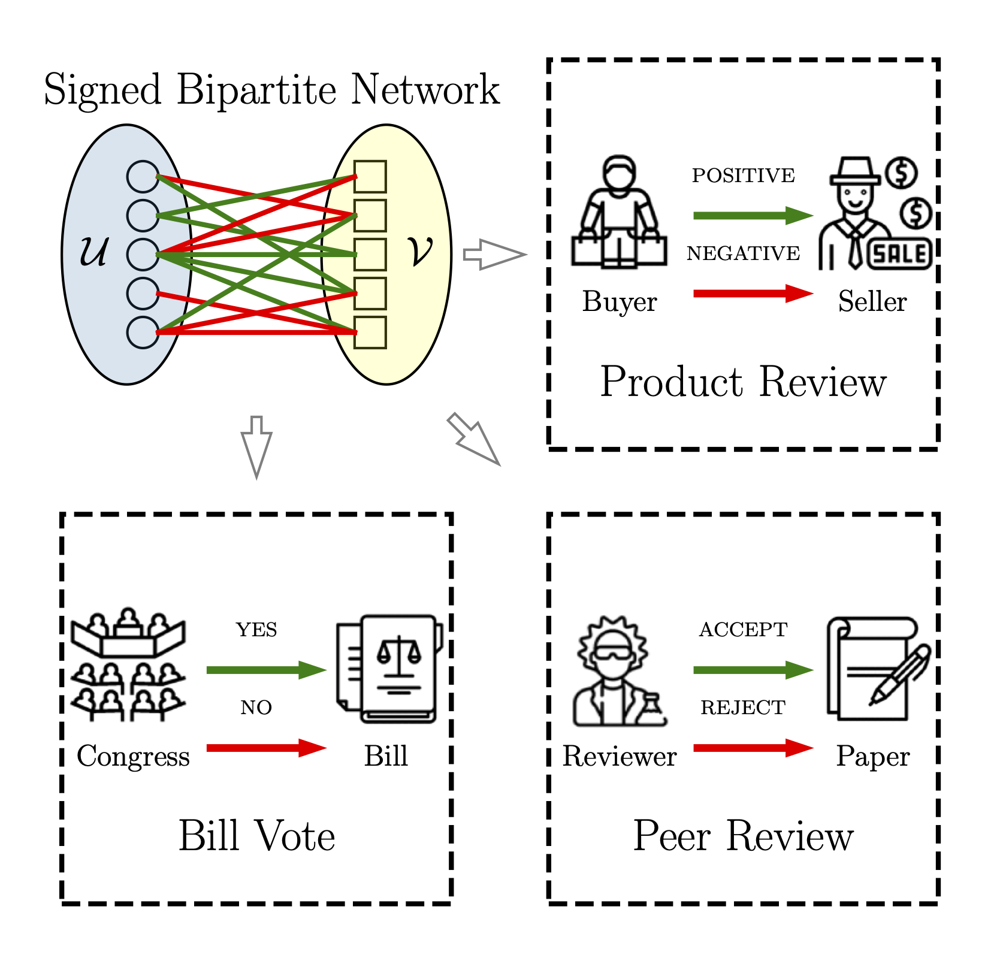
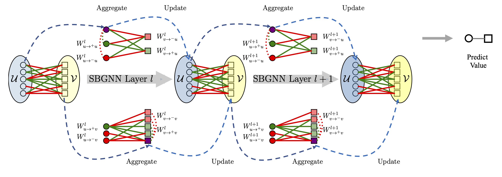

# Signed Bipartite Graph Neural Networks

## This is our PyTorch implementation code for our paper:
> Signed Bipartite Graph Neural Networks (CIKM2021)
> 
> [arXiv](https://arxiv.org/abs/2108.09638)


## Introduction

<div style="margin: 20px;">


<p>
Figure shows some common application scenarios for signed bipartite networks, including <strong>product review, bill
vote, and peer review</strong>. 
</p>
<p>Some opinions can be viewed as positive
relationships, such as favorable reviews on products, supporting
the bill, accepting a paper, and so on. Meanwhile, some opinions
are negative links that indicate negative reviews, disapproving a
bill, rejecting a paper, and so forth. These scenarios can be modeled
as signed bipartite networks, which include two sets of nodes (i.e.,
U and V) and the links with positive and negative relationships
between two sets.
</p>
</div>

<br/>

## Method


<div style="margin: 20px;">
 Illustration of SBGNN. SBGNN Layer includes Aggeregate and Update functions. The aggregated message comes from the Set1 and Set2 with positive and negative links. After getting the embedding of the node u_i and v_i, it can be used to predict the link sign relationship.
</div>

## Dataset

For `bonanza, house, senate`, you can download it from this [repository](https://github.com/tylersnetwork/signed_bipartite_networks).
For `review` dataset, you can download [it](./experiments-data/review-cikm2021.txt) in ```experiments-data``` folder.


## Dependency
In order to run this code, you need to install following dependencies:

```
pip install torch numpy sklearn tqdm tensorboard
```


## Run Example

```
python sbgnn.py --lr 5e-3 --seed 222 \
                --dataset_name house1to10-1 --gnn_layer 2 \
                --epoch 2000 --agg AttentionAggregator
```

Results:

```
test_auc 0.8498742632577166 
test_f1 0.8592910848549948 
test_macro_f1 0.848896372204643 
test_micro_f1 0.8496114447191806
```

## Citation

Please cite our paper if you use this code in your own work

```
@inproceedings{huang2021signed,
  title     = {Signed Bipartite Graph Neural Networks},
  author    = {Huang, Junjie and Shen, Huawei and Cao, Qi and Tao, ShuChang and Cheng, Xueqi},
  booktitle = {{CIKM} '21: The 30th {ACM} International Conference on Information
               and Knowledge Management, Virtual Event, Queensland, Australia, November
               1 - 5, 2021},  
  year      = {2021},
  pages     = {740--749},
  publisher = {{ACM}},
  year      = {2021},
  url       = {https://doi.org/10.1145/3459637.3482392},
  doi       = {10.1145/3459637.3482392},
}
```
